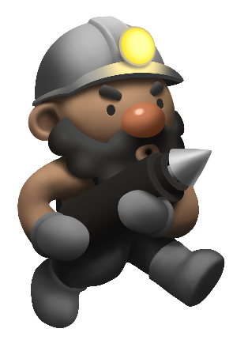
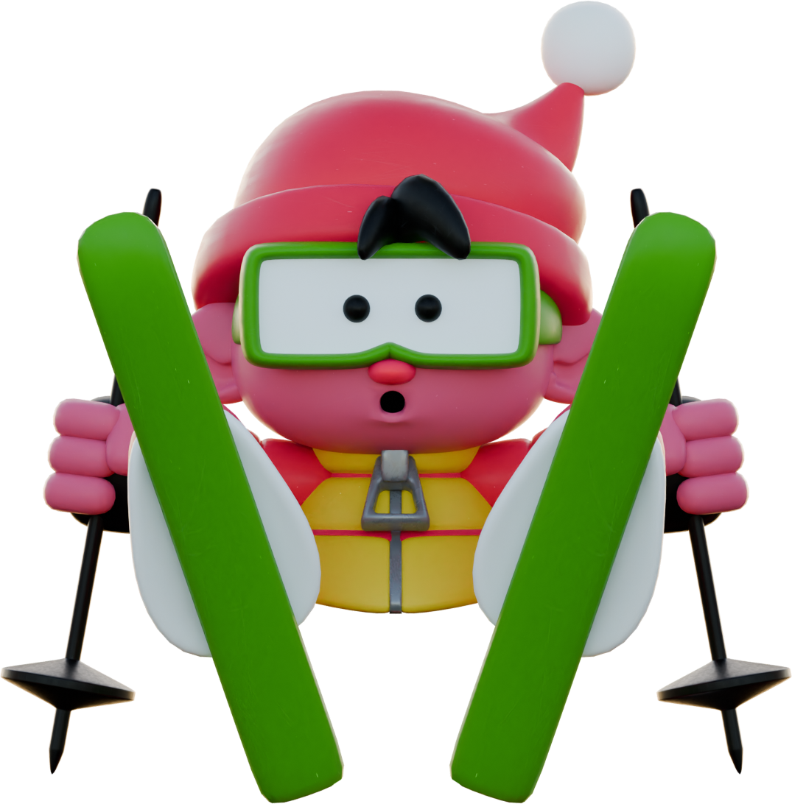

### Howdy 👋 

<table align="center"><tr><td colspan="7" align="center"> Public Projects Personal projects currently published online</td></tr><tr><td></td><td class="display: flex; flex-direction: column;">
<h3>Cavern Collapse</h3>

High score arcade survival game in a collapsing cavern
</td><td class="display: flex; flex-direction: column;"><a style="font-size: 12px; display: flex; flex-direction: row; align-items: flex-start; justify-content: flex-start; " href="https://cyranek.itch.io/cavern-collapse">itch.io</a> <a style="font-size: 12px; display: flex; flex-direction: row; align-items: flex-start; justify-content: flex-start; " href="https://www.newgrounds.com/portal/view/860822">Newgrounds</a> </td><td class="display: flex; flex-direction: column;"><a style="font-size: 12px; display: flex; flex-direction: row; align-items: flex-start; justify-content: flex-start; " href="https://apps.apple.com/us/app/cavern-collapse/id6451268649">iOS</a> <a style="font-size: 12px; display: flex; flex-direction: row; align-items: flex-start; justify-content: flex-start; " href="https://play.google.com/store/apps/details?id=cyranek.com.cyranek.caverncollapse&hl=en_US&gl=US">Android</a> </td><tr><td></td><td class="display: flex; flex-direction: column;">
<h3>Ski Freak</h3>

Coming Soon
</td><td class="display: flex; flex-direction: column;"></td><td class="display: flex; flex-direction: column;"></td><tr><td></td><td class="display: flex; flex-direction: column;">
<h3>Vanity Plate Social</h3>

Consolidated retrieval and display of social media stats
</td><td class="display: flex; flex-direction: column;"><a style="font-size: 12px; display: flex; flex-direction: row; align-items: flex-start; justify-content: flex-start; " href="https://github.com/hncleary/vanity-plate-ng">Site Source</a> <a style="font-size: 12px; display: flex; flex-direction: row; align-items: flex-start; justify-content: flex-start; " href="https://github.com/hncleary/vanity-plate-pr">Retrieval</a> </td><td class="display: flex; flex-direction: column;"><a style="font-size: 12px; display: flex; flex-direction: row; align-items: flex-start; justify-content: flex-start; " href="https://www.vanityplate.social/home">Website</a> </td><tr><td></td><td class="display: flex; flex-direction: column;">
<h3>Duuzu Key BPM DB</h3>

Searchable song key and bpm database website for DJs
</td><td class="display: flex; flex-direction: column;"><a style="font-size: 12px; display: flex; flex-direction: row; align-items: flex-start; justify-content: flex-start; " href="https://black-water-0be05fd10.5.azurestaticapps.net/home">Website</a> <a style="font-size: 12px; display: flex; flex-direction: row; align-items: flex-start; justify-content: flex-start; " href="https://github.com/hncleary/duuzu-key-bpm-db">Source</a> </td><td class="display: flex; flex-direction: column;"></td></table>